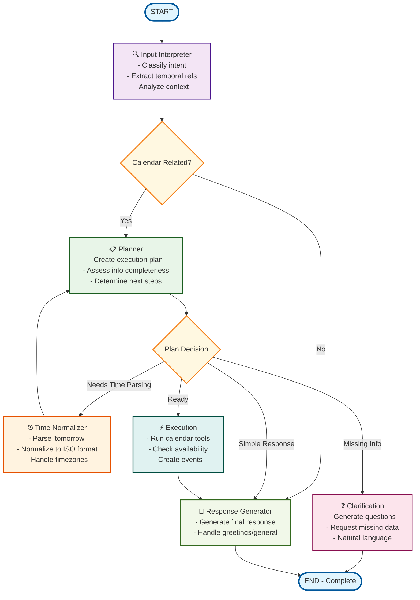

# Athena LangGraph Architecture

## Main Flow Diagram

## Description

This diagram shows the sophisticated reasoning flow of Athena's LangGraph-based agent:

### Nodes:
1. **Input Interpreter** 🔍: Analyzes incoming messages, classifies intent, and extracts temporal references
2. **Planner** 📋: Creates execution plans and assesses information completeness
3. **Time Normalizer** ⏰: Converts natural language time references to ISO format
4. **Clarification** ❓: Generates natural follow-up questions when information is missing
5. **Execution** ⚡: Executes calendar tools and processes results
6. **Response Generator** 💬: Creates final responses based on context and results

### Conditional Edges:
- **Calendar vs Direct Response**: Routes calendar-related requests through planning
- **Planner Decision Tree**: Determines if time normalization, clarification, or execution is needed

### Key Benefits:
- ✅ Handles incomplete requests gracefully
- ✅ Normalizes time expressions automatically  
- ✅ Asks clarifying questions naturally
- ✅ Plans multi-step operations
- ✅ Provides sophisticated reasoning capabilities
- ✅ Enhanced user experience with natural conversation flow
