# Detailed State Flow

```mermaid
graph LR
    subgraph "State Schema"
        S1[messages: List]
        S2[user_id: str]
        S3[intent: str]
        S4[plan: List]
        S5[normalized_times: Dict]
        S6[tool_results: List]
        S7[final_response: str]
    end
    
    subgraph "Input Processing"
        I1["Message Analysis"]
        I2["Intent Classification"]
        I3["Context Extraction"]
        I1 --> I2 --> I3
    end
    
    subgraph "Planning Phase"
        P1["Plan Creation"]
        P2["Info Assessment"]
        P3["Dependency Check"]
        P1 --> P2 --> P3
    end
    
    subgraph "Execution Phase"
        E1["Tool Preparation"]
        E2["Calendar API Calls"]
        E3["Result Processing"]
        E1 --> E2 --> E3
    end
    
    subgraph "Response Phase"
        R1["Response Generation"]
        R2["Memory Update"]
        R3["Final Output"]
        R1 --> R2 --> R3
    end
    
    I3 --> P1
    P3 --> E1
    E3 --> R1
```

## State Management

The LangGraph maintains a comprehensive state schema that tracks:
- Message history and context
- User and contact information
- Intent classification results
- Execution plans and completeness
- Normalized time references
- Tool execution results
- Final responses and metadata

## Processing Phases

1. **Input Processing**: Analyzes incoming messages and extracts relevant information
2. **Planning Phase**: Creates execution plans and assesses information completeness
3. **Execution Phase**: Runs tools and processes calendar operations
4. **Response Phase**: Generates final responses and updates conversation memory
